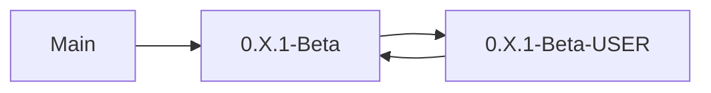
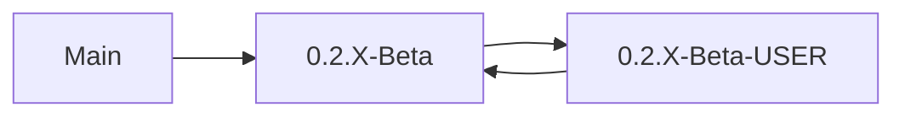

# Work Flow
##### **Current Version**
Push all new creations to beta branch under your specific USER branch

After conducting a sprint we can test the current beta branch, work out any compatibility issues and once stable push to main branch, and update beta to the next iteration
##### **New Version**

---

# Dependencies

Current Dependencies:
 - <a href="https://kordamp.org/ikonli" title="Ikonli">Ikonli</a> - For Icons within JavaFX

---

# Project Artifacts
**Trello** - <a href="https://trello.com/b/mpXRuewo/kanban-valtracker" title="Trello">Click Here</a>

**Planning Document** -  <a href="https://docs.google.com/document/d/1hIcoOruoC8xPmuXMUxzN9V4KKmBMKsP9LJqwm5hEZnM/edit#heading=h.10uml1mjtve7" title="CAB302 Planning Document">Click Here</a>
### Project Goal
Player tracker for FPS games, with match results, stats, rank 
Potentially Valorant - valorant.op.gg
Complexity estimate: ★★★★☆ 
What/Why use product:
- GUI: Pages/sections for different games, players, leaderboards, search tool, user account
- Authentication: Sign up & log in. Logged in users can set the privacy of their player profile/s, customise their player profiles(?), add their game accounts
- Data: DB for games, matches, leaderboards, user info
- Add friends?
- Set goals?
- Notify friends when going online/playing etc?
- Relevant feedback?

